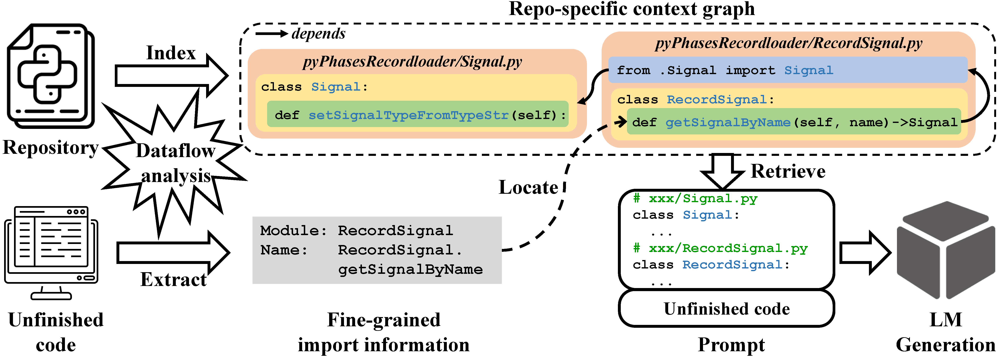

# DraCo

Dataflow-Guided Retrieval Augmentation for Repository-Level Code Completion, ACL 2024 (main).

## Overview

In this paper, we present **DraCo**, a novel dataflow-guided retrieval augmentation approach for repository-level code completion, which steers code LMs with relevant background knowledge rather than similar code snippets. 
DraCo employs the standard RAG framework including indexing, retrieval, and generation.
We extend traditional dataflow analysis by setting type-sensitive dependency relations, and both indexing and retrieval in DraCo rely on the extended dataflow analysis.


**Figure 1. The overview of our DraCo.**

We also present a new dataset, **ReccEval**, with diverse completion targets collected from PyPI. 
Our experiments demonstrate that DraCo achieves generally superior accuracy and efficiency compared to the baselines.

## ReccEval Dataset

Each sample in ReccEval (`ReccEval/metadata.jsonl`) contains the following fields:

- `pkg`: the repository it belongs to, e.g., `a13e`.
- `fpath`: the file path where the code to be completed, e.g., `a13e/a13e-0.0.1/a13e/plugins/neteasecloudmusic/neteasemusic.py`.
- `input`: the content before the cursor position to be completed.
- `gt`: the ground truth of the code line to be completed.

The original repositories of ReccEval contains all Python files.

```
cd ReccEval
tar -zvxf Source_Code.tar.gz
```

## Quickstart
### Prepare Environment

Our DraCo is developed on Ubuntu 16.04 LTS.

```
conda create -n DraCo python=3.10
pip install -r requirements.txt
```

### Repo-specific Context Graph
During offline preprocessing, we build a repo-specific context graph for each repository in the datasets:

```
cd src && python preprocess.py
```

### Code Completion
In real-time code completion, we generate the prompts for querying code language models (LMs):

```
cd src && python main.py --model $MODEL --file $OUT_FILE
```

### Notes 
- We support for CodeGen, CodeGen25, SantaCoder, StarCoder, Code Llama, GPT models (see details in our paper).
If you want to use local models or add other models, please modify their tokenizers in `src/config.yaml` and `src/tokenizer.py`.
- The constants in `src/utils.py` control the behavior of DraCo and the paths associated with the used dataset.
- To make the code more intuitive and applicable to different evaluations, we return decoded prompts. 
This operation may lead to small fluctuations in the number of tokens (usually 0~2 tokens), but please don't truncate our well-formed prompts!


## Citation

If you find the work useful, please kindly cite it as follows:      

```
@inproceedings{DraCo,
  author    = {Wei Cheng and Yuhan Wu and Wei Hu},
  title     = {Dataflow-Guided Retrieval Augmentation for Repository-Level Code Completion},
  booktitle = {ACL},
  year      = {2024}
}
```
